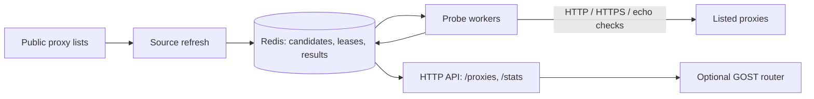

# FreeProxyAPI

[](https://github.com/Crawlora-org/FreeProxyAPI/actions/workflows/ci.yml)
[](LICENSE)

FreeProxyAPI collects proxy endpoints that third parties have published in
public lists, tests whether they currently work, and serves the validated
results through a small HTTP API. Beyond "is it up", it measures latency,
anonymity, exit country, HTTPS/CONNECT support, and whether a proxy tampers with
traffic, so you can filter on what you actually need.

Hosted service (rate limited, best effort):
[freeproxyapi.crawlora.net](https://freeproxyapi.crawlora.net/). You can also
run your own instance; see [Quick start](#quick-start).

```sh
curl 'https://freeproxyapi.crawlora.net/proxies?exit_country=US&min_ratio_pct=80&https=1&limit=2'
```

```json
{
  "count": 2,
  "limit": 2,
  "offset": 0,
  "has_more": true,
  "proxies": [
    {
      "url": "http://203.0.113.10:8080",
      "scheme": "http",
      "country": "US",
      "exit_country": "US",
      "anonymity": "elite",
      "latency_ms": 412,
      "ok_ratio_pct": 90,
      "https_ok": true,
      "tampered": false
    }
  ]
}
```

(Illustrative: the address is from a documentation range and several fields are
trimmed. See the [API reference](docs/api.md) for the full response.)

## What it is, and what it is not

- It **does not scan** networks or discover hosts. It only tests endpoints that
  appear in the feeds you configure, and it refuses private and non-public
  addresses.
- Validation is **off by default** and bounded by a global request budget.
- It is **not** a guarantee. Most listed proxies are dead or unreliable, and
  results describe the moment of the last check. Anonymity, exit country, and
  tamper results come from an echo the proxy itself can influence: treat them as
  hints. Never send credentials or sensitive data through a listed proxy.
- Use it only with proxies and targets you are authorized to access. See
  [responsible use](docs/responsible-use.md) and
  [acceptable use](ACCEPTABLE_USE.md).

## How it works



Feeds are fetched on an interval and deduplicated into a Redis queue. Replicas
claim due candidates with leases, probe them within a shared request budget, and
record latency, success ratio, anonymity, HTTPS, and tamper results. A proxy is
listed only after several successful samples, and is re-checked soon after a
failure.

| | Hosted service | Self-hosted |
| --- | --- | --- |
| Setup | none | Go or Docker, Redis, your own feeds |
| Feeds and probe target | operated by Crawlora | yours |
| Limits | 60 requests/min per IP, best effort, no SLA | yours |
| Analytics | Google Analytics on the web pages | off unless you configure it |

## Quick start

You need Docker with Compose for the Compose route, or Go 1.27.1 or newer (see
`go.mod`) to run from source. Redis is only needed to run `monitor` directly.

### Parse a local feed

Parsing is local-only: it reads the file and does not make network requests.

```sh
go run ./cmd/freeproxyapi parse -input ./examples/proxies.txt
```

Use `-default-scheme` when `host:port` records should use a scheme other than
`http`.

### Run with Docker Compose

The included Compose setup starts FreeProxyAPI and Redis. It mounts
`examples/proxies.txt` as the input feed and keeps network validation disabled.

```sh
docker compose up --build
```

Then open <http://localhost:8080/>.

**What you will see:** the service starts and the page loads, but `/proxies`
returns no proxies yet. Compose ships with `network_validation_enabled` set to
`false`, so the monitor loads the sample feed into Redis but starts no probe
workers, and a proxy is listed only after it passes several probes
(`min_samples_for_listing`, default 3). The sample feed also holds
documentation-range addresses that will never answer. For real results, point
`sources` at a feed you are allowed to use and turn validation on as described
next.

To use your own feed with Compose, replace `examples/proxies.txt`, or update
the feed volume mapping and the `sources` entry in
[`examples/monitor.json`](examples/monitor.json) together. To enable
validation, set `network_validation_enabled` to `true` and provide a probe
target that you operate and have permission to use. See the
[responsible-use guide](docs/responsible-use.md) before enabling validation at
scale.

> **Validation notice:** Availability can change after a response is cached.
> Only use proxies and target websites you are authorized to access, and follow
> applicable laws, terms, and network policies. Before running large-scale
> validation in the cloud, consult your provider first: high-volume traffic can
> trigger abuse systems or be mistaken for scanning or DDoS-like activity.

## HTTP API

The monitor listens on port `8080` by default. The full reference, including
every `/proxies` filter, the response schema, and error codes, is in
[docs/api.md](docs/api.md).

| Endpoint | Description |
| --- | --- |
| `/proxies` | Public, validated proxies, filterable by country, exit country, ASN, latency, success ratio, anonymity, HTTPS, tamper status, and age. Paged, cached, and rate limited per client IP. |
| `/stats` | Aggregate counts by country, anonymity, and latency band. Never returns proxy URLs. |
| `/get` | httpbin-compatible caller-IP echo for operator-controlled checks. |
| `/livez`, `/readyz` | Liveness and readiness (`503` when Redis is unavailable). |
| `/`, `/dashboard`, `/dashboard/data` | Built-in homepage and operations dashboard (the dashboard needs `prometheus_url`). |
| `/metrics`, `/report` | Operator endpoints: Prometheus metrics and monitor status. Served on `admin_listen_addr` when set. |
| `/internal/api/v1/proxies` | Bearer-token internal API, disabled unless `internal_api_token_file` is set. Served on `admin_listen_addr` when set; keep it on an internal network. |

```sh
curl 'http://localhost:8080/proxies?country=US&max_latency_ms=1000&limit=10'
```

Client identity uses the socket peer by default. Configure
`trusted_proxy_cidrs` only for controlled ingress that strips caller-supplied
forwarding headers and writes trusted values. For tunnel deployments,
`/stats?echo=1` provides the same echo response as `/get`. Privacy details are
in [docs/privacy.md](docs/privacy.md).

## Configuration

`monitor` requires a JSON configuration file and a Redis instance:

```sh
go run ./cmd/freeproxyapi monitor -config ./path/to/monitor.json
```

The checked-in example config is for Compose, where the Redis hostname is
`redis` and the feed is mounted at `/data/proxies.txt`. For a host-run monitor,
use a config whose Redis URL and source paths are reachable from your host, such
as `redis://127.0.0.1:6379/0` and a local feed path.

The settings you will touch first:

- `redis_url` — Redis connection. `FREEPROXYAPI_REDIS_URL` overrides it so a
  Redis password need not be written to the config file.
- `sources` — proxy feeds, such as `file:///data/proxies.txt`. At least one is
  required.
- `network_validation_enabled` and `probe_target` — validation is off by
  default; when on, it needs a probe target you operate and may use.
- `workers` and `global_requests_per_minute` — validation concurrency and the
  request budget shared by all replicas.
- `listen_addr` (default `:8080`) and `admin_listen_addr` — the public listener
  and an optional second one for `/metrics`, `/report`, and the internal API.
  `/metrics` exposes feed hostnames and probe settings, so when
  `admin_listen_addr` is empty those endpoints share the public listener and
  your ingress must not forward them.
- `public_base_url`, `geoip_db_path`, and `geoip_asn_db_path` — public origin
  for the built-in pages, and optional GeoIP databases.
- `analytics_measurement_id` — empty by default, so the built-in pages load no
  third-party scripts. See [docs/privacy.md](docs/privacy.md) before setting it.

Every key, its default and valid range, and the environment overrides are in
the [configuration reference](docs/configuration.md). See
[`examples/monitor-gost.json`](examples/monitor-gost.json) for a validation and
GeoIP-enabled example, and replace its `probe_target` with an endpoint you
operate and have approval to use before enabling validation. The deployment flow
is in [docs/deployment.md](docs/deployment.md).

## GOST router

FreeProxyAPI can supply validated proxies to a country-aware GOST router, either
from your own monitor or, with no monitor or Redis at all, from the hosted API.
The sidecar-only recipes, with the bootstrap file, credentials, and filters they
need, are in [docs/gost-router.md](docs/gost-router.md):

- Docker Compose: [`docker-compose.gost-public-sidecar.yml`](docker-compose.gost-public-sidecar.yml)
- Kubernetes: [`k8s/overlays/gost-public-sidecar`](k8s/overlays/gost-public-sidecar)

GOST listens on `127.0.0.1:3128` by default, the unified pool. Country
listeners start at `3129`, assigned in alphabetical order of the country codes
(`DE`, `SG`, `US` map to `3129`–`3131` by default). Every listener requires the
client credentials you configure.

Both recipes use only proxies and target websites you are authorized to access;
review the [responsible-use guide](docs/responsible-use.md) before increasing
refresh frequency, result limits, or validation traffic.

## Development

```sh
make check   # gofmt check, go vet, go test, go test -race
```

CI additionally runs `staticcheck` and `govulncheck` and renders the Kubernetes
manifests. See [CONTRIBUTING.md](CONTRIBUTING.md).

Container images are published to
`ghcr.io/crawlora-org/freeproxyapi` by GitHub Actions.

More documentation:

- [HTTP API reference](docs/api.md)
- [Configuration reference](docs/configuration.md)
- [Deployment](docs/deployment.md)
- [New-cluster checklist](docs/new-cluster-checklist.md)
- [Manual production deploy (break glass)](docs/manual-deploy.md)
- [Responsible use](docs/responsible-use.md) and [acceptable use](ACCEPTABLE_USE.md)
- [Privacy](docs/privacy.md)
- [Redis schema](docs/redis-schema.md)
- [GOST router](docs/gost-router.md)
- [Contributing](CONTRIBUTING.md), [security policy](SECURITY.md), [changelog](CHANGELOG.md)

## License

MIT. See [LICENSE](LICENSE) and [third-party notices](THIRD_PARTY_NOTICES.md).

GeoIP data, when you provide it: This product includes GeoLite2 Data created by
MaxMind, available from <https://www.maxmind.com>. You need your own MaxMind
license; the software does not bundle any database.

"FreeProxyAPI" and "Crawlora" are used for the hosted service at
freeproxyapi.crawlora.net, which Crawlora operates. If you fork and run your own
public service, please use your own name.
