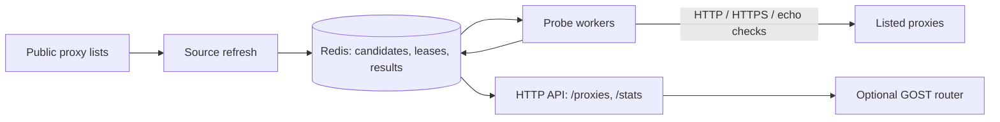

# FreeProxyAPI

[](https://github.com/Crawlora-org/FreeProxyAPI/actions/workflows/ci.yml)
[](LICENSE)

FreeProxyAPI collects proxy endpoints that third parties have published in
public lists, tests whether they currently work, and serves the validated
results through a small HTTP API. Beyond "is it up", it measures latency,
anonymity, exit country, HTTPS/CONNECT support, and whether a proxy tampers with
traffic, so you can filter on what you actually need.

Hosted service (rate limited, best effort):
[freeproxyapi.crawlora.net](https://freeproxyapi.crawlora.net/). You can also
run your own instance; see [Quick start](#quick-start).

```sh
curl 'https://freeproxyapi.crawlora.net/proxies?exit_country=US&min_ratio_pct=80&https=1&limit=2'
```

```json
{
  "count": 2,
  "limit": 2,
  "offset": 0,
  "has_more": true,
  "proxies": [
    {
      "url": "http://203.0.113.10:8080",
      "scheme": "http",
      "country": "US",
      "exit_country": "US",
      "anonymity": "elite",
      "latency_ms": 412,
      "ok_ratio_pct": 90,
      "https_ok": true,
      "tampered": false
    }
  ]
}
```

(Illustrative: the address is from a documentation range and several fields are
trimmed. See the [API reference](docs/api.md) for the full response.)

## What it is, and what it is not

- It **does not scan** networks or discover hosts. It only tests endpoints that
  appear in the feeds you configure, and it refuses private and non-public
  addresses.
- Validation is **off by default** and bounded by a global request budget.
- It is **not** a guarantee. Most listed proxies are dead or unreliable, and
  results describe the moment of the last check. Anonymity, exit country, and
  tamper results come from an echo the proxy itself can influence: treat them as
  hints. Never send credentials or sensitive data through a listed proxy.
- Use it only with proxies and targets you are authorized to access. See
  [responsible use](docs/responsible-use.md) and
  [acceptable use](ACCEPTABLE_USE.md).

## How it works



Feeds are fetched on an interval and deduplicated into a Redis queue. Replicas
claim due candidates with leases, probe them within a shared request budget, and
record latency, success ratio, anonymity, HTTPS, and tamper results. A proxy is
listed only after several successful samples, and is re-checked soon after a
failure.

| | Hosted service | Self-hosted |
| --- | --- | --- |
| Setup | none | Go or Docker, Redis, your own feeds |
| Feeds and probe target | operated by Crawlora | yours |
| Limits | 60 requests/min per IP, best effort, no SLA | yours |
| Analytics | Google Analytics on the web pages | off unless you configure it |

## Quick start

### Parse a local feed

Parsing is local-only: it reads the file and does not make network requests.

```sh
go run ./cmd/freeproxyapi parse -input ./examples/proxies.txt
```

Use `-default-scheme` when `host:port` records should use a scheme other than
`http`. Go 1.27.1 or newer is required.

### Run with Docker Compose

The included Compose setup starts FreeProxyAPI and Redis. It mounts
`examples/proxies.txt` as the input feed and keeps network validation disabled.

```sh
docker compose up --build
```

Then open <http://localhost:8080/>.

To use your own feed with Compose, replace `examples/proxies.txt`, or update
the feed volume mapping and the `sources` entry in
[`examples/monitor.json`](examples/monitor.json) together. To enable
validation, set `network_validation_enabled` to `true` and provide a probe
target that you operate and have permission to use. See the
[responsible-use guide](docs/responsible-use.md) before enabling validation at
scale.

> **Validation notice:** Availability can change after a response is cached.
> Only use proxies and target websites you are authorized to access, and follow
> applicable laws, terms, and network policies. Before running large-scale
> validation in the cloud, consult your provider first: high-volume traffic can
> trigger abuse systems or be mistaken for scanning or DDoS-like activity.

## HTTP API

The monitor listens on port `8080` by default. The full reference, including
every `/proxies` filter, the response schema, and error codes, is in
[docs/api.md](docs/api.md).

| Endpoint | Description |
| --- | --- |
| `/proxies` | Public, validated proxies, filterable by country, exit country, ASN, latency, success ratio, anonymity, HTTPS, tamper status, and age. Paged, cached, and rate limited per client IP. |
| `/stats` | Aggregate counts by country, anonymity, and latency band. Never returns proxy URLs. |
| `/get` | httpbin-compatible caller-IP echo for operator-controlled checks. |
| `/livez`, `/readyz` | Liveness and readiness (`503` when Redis is unavailable). |
| `/`, `/dashboard`, `/dashboard/data` | Built-in homepage and operations dashboard (the dashboard needs `prometheus_url`). |
| `/metrics`, `/report` | Operator endpoints: Prometheus metrics and monitor status. Served on `admin_listen_addr` when set. |
| `/internal/api/v1/proxies` | Bearer-token internal API, disabled unless `internal_api_token_file` is set. Served on `admin_listen_addr` when set; keep it on an internal network. |

```sh
curl 'http://localhost:8080/proxies?country=US&max_latency_ms=1000&limit=10'
```

Client identity uses the socket peer by default. Configure
`trusted_proxy_cidrs` only for controlled ingress that strips caller-supplied
forwarding headers and writes trusted values. For tunnel deployments,
`/stats?echo=1` provides the same echo response as `/get`. Privacy details are
in [docs/privacy.md](docs/privacy.md).

## Configuration

`monitor` requires a JSON configuration file and a Redis instance:

```sh
go run ./cmd/freeproxyapi monitor -config ./path/to/monitor.json
```

The checked-in example config is for Compose, where the Redis hostname is
`redis` and the feed is mounted at `/data/proxies.txt`. For a host-run monitor,
use a config whose Redis URL and source paths are reachable from your host, such
as `redis://127.0.0.1:6379/0` and a local feed path.

Important settings include:

- `redis_url` — Redis connection used by monitor workers.
- `sources` — proxy feeds such as `file:///data/proxies.txt`.
- `listen_addr` — HTTP listen address; defaults to `:8080`.
- `admin_listen_addr` — optional second listener (for example
  `127.0.0.1:9090`) for the operator endpoints `/metrics`, `/report`, and
  `/internal/api/v1/proxies`, which are then absent from `listen_addr`.
  `/metrics` exposes feed hostnames and probe settings, so when this is empty
  (the compatibility default) those endpoints share the public listener and
  your ingress must not forward them. The checked-in Compose example binds it
  to the container's loopback; bind `0.0.0.0:9090` and publish the port only
  on a network you control to scrape it.
- `network_validation_enabled` — enables proxy checks; disabled by default.
- `probe_target` — target used when validation is enabled.
- `probe_expected_body` — optional exact response body (trailing whitespace
  ignored) required for a standard-mode probe to pass; empty accepts any 2xx.
- `min_samples_for_listing` (default 3, 1–10), `sample_retest_interval`
  (default 60s), and `listed_failure_retest_interval` (default 5m) — how many
  probes a proxy needs before it is listed, and how soon unproven or failing
  listed proxies are re-probed.
- `max_records_per_source` (default 250000) and `max_candidates` (default 0 =
  off) — bound how many endpoints one feed, and all feeds together, can add to
  Redis; see [Securing Redis and bounding feed intake](docs/deployment.md#securing-redis-and-bounding-feed-intake).
  `FREEPROXYAPI_REDIS_URL` overrides `redis_url` so a Redis password need not
  be written to the config file.
- `workers` and `global_requests_per_minute` — validation concurrency and
  shared request budget.
- `redis_pool_size` (default 0 = one connection per 32 workers, 10–32; max
  256) and `redis_api_pool_size` (default 8, max 64) — per-replica Redis
  connection caps. Workers and background jobs share the first pool; HTTP
  reads (`/proxies`, the internal API, `/stats`, `/report`, `/dashboard/data`,
  `/readyz`) use the second, so busy workers cannot make them wait for a
  connection. An HTTP read gives up after 2s without a free connection.
- `geoip_db_path` and `geoip_asn_db_path` — optional GeoIP databases.
- `public_base_url` — public origin of your deployment (for example
  `https://proxies.example.com`). Used for the canonical, Open Graph, and
  code-sample URLs on the built-in pages; leave empty and the page samples
  show the origin the visitor reached and the canonical tags are omitted.
- `analytics_measurement_id` — optional Google Analytics 4 ID (`G-XXXXXXXXXX`).
  Empty by default: the built-in pages load no third-party scripts and send
  nothing to Google. Set it only if you accept analytics on your own visitors
  and have given them any notice or choice the law where they live requires.
- `cloudflare_web_analytics` — set to `true` only if Cloudflare Web Analytics
  auto-install is on for your hostname: it lets the injected beacon script
  through the pages' Content-Security-Policy. Off by default.
- `https_probe_target` (default empty = disabled), `https_probe_expected_body`,
  and `https_probe_every` (default 4, 1–1000) — after roughly one in N
  successful probes, and only when the global budget grants one more permit,
  fetch this https URL through the proxy's CONNECT (or SOCKS) tunnel with TLS
  verification and record `https_ok`/`https_checked_at_ms`. An `https://`
  proxy whose own TLS handshake fails (non-TLS reply or untrusted certificate)
  is retried as a plain CONNECT proxy.
- `control_probe_enabled` (default true), `control_probe_interval` (default
  60s, at least 1s), and `control_probe_failure_threshold` (default 3, 1–100) —
  each replica fetches `probe_target` directly; after the threshold of
  consecutive failures its workers stop claiming work and failed outcomes are
  released uncommitted until one control check succeeds.
- `classification_max_age` (default 24h) — age after which anonymity/exit and
  HTTPS measurements are treated as unknown in `/proxies`. Aggregate `/stats`
  and metrics breakdowns still count stored values regardless of age.

See [`examples/monitor-gost.json`](examples/monitor-gost.json) for a validation
and GeoIP-enabled configuration reference. Replace its `probe_target` with an
endpoint you operate and have approval to use before enabling validation.
Environment variables can override selected runtime settings; the full
deployment flow is in [docs/deployment.md](docs/deployment.md).

## GOST router

FreeProxyAPI can supply validated proxies to a country-aware GOST router. For a
complete setup, see [docs/gost-router.md](docs/gost-router.md).

### Sidecar-only with Docker Compose

This starts only GOST and the `proxy-router` refresh sidecar. It does not start
the FreeProxyAPI monitor or Redis. Prepare matching GOST API credentials before
starting it so the sidecar can reload the generated configuration:

```sh
mkdir -p runtime
export GOST_API_USERNAME='choose-an-admin-user'
export GOST_API_PASSWORD='choose-an-admin-password'
export GOST_PROXY_USERNAME='choose-a-client-user'
export GOST_PROXY_PASSWORD='choose-a-client-password'
export FREEPROXYAPI_EXIT_COUNTRY='US'
export FREEPROXYAPI_MIN_RATIO_PCT='80'

python3 - <<'PY'
import json
import os

with open('runtime/gost.json', 'w', encoding='utf-8') as output:
    json.dump({
        'api': {
            'addr': ':18080',
            'auth': {
                'username': os.environ['GOST_API_USERNAME'],
                'password': os.environ['GOST_API_PASSWORD'],
            },
        },
    }, output)
    output.write('\n')
os.chmod('runtime/gost.json', 0o600)
PY

docker compose -f docker-compose.gost-public-sidecar.yml up -d
docker compose -f docker-compose.gost-public-sidecar.yml logs -f proxy-router
```

The sidecar reads validated results from
`https://freeproxyapi.crawlora.net/proxies`, applies the optional filters, and
refreshes GOST every minute. GOST listens on `127.0.0.1:3128` by default; the
Compose file also provides country listeners on ports `3129`–`3131`.

### Sidecar-only with Kubernetes

The Kubernetes overlay is also standalone: it creates only a GOST plus
`proxy-router` Pod and does not run the proxy validator, monitor, or Redis.
Create its four credentials, review the filter values in
`k8s/overlays/gost-public-sidecar/deployment.yaml`, then apply it:

```sh
kubectl apply -f k8s/overlays/gost-public-sidecar/namespace.yaml
kubectl -n gost-public create secret generic gost-public-auth \
  --from-literal=proxy-username='choose-a-client-user' \
  --from-literal=proxy-password='choose-a-client-password' \
  --from-literal=api-username='choose-an-admin-user' \
  --from-literal=api-password='choose-an-admin-password'
kubectl apply -k k8s/overlays/gost-public-sidecar
kubectl -n gost-public rollout status deployment/gost-public-sidecar --timeout=180s
```

The Service exposes the authenticated GOST listener on port `3128` and the
optional country listeners on `3129`–`3131`. For port-forwarded local access:

```sh
kubectl -n gost-public port-forward svc/gost-public-sidecar 3128:3128
```

Both recipes use only proxies and target websites you are authorized to access;
review the [responsible-use guide](docs/responsible-use.md) before increasing
refresh frequency, result limits, or validation traffic.

## Development

```sh
go test ./...
go vet ./...
```

Container images are published to
`ghcr.io/crawlora-org/freeproxyapi` by GitHub Actions.

More documentation:

- [HTTP API reference](docs/api.md)
- [Deployment](docs/deployment.md)
- [Manual production deploy (break glass)](docs/manual-deploy.md)
- [Responsible use](docs/responsible-use.md) and [acceptable use](ACCEPTABLE_USE.md)
- [Privacy](docs/privacy.md)
- [Redis schema](docs/redis-schema.md)
- [GOST router](docs/gost-router.md)
- [Contributing](CONTRIBUTING.md), [security policy](SECURITY.md), [changelog](CHANGELOG.md)

## License

MIT. See [LICENSE](LICENSE) and [third-party notices](THIRD_PARTY_NOTICES.md).

GeoIP data, when you provide it: This product includes GeoLite2 Data created by
MaxMind, available from <https://www.maxmind.com>. You need your own MaxMind
license; the software does not bundle any database.

"FreeProxyAPI" and "Crawlora" are used for the hosted service at
freeproxyapi.crawlora.net, which Crawlora operates. If you fork and run your own
public service, please use your own name.
